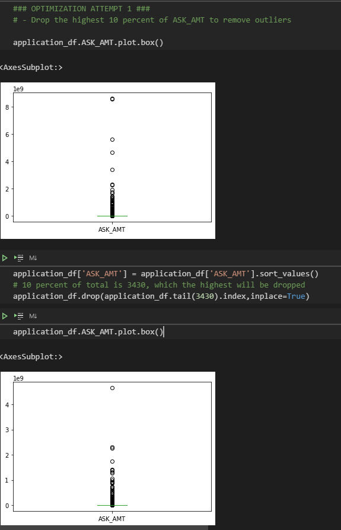
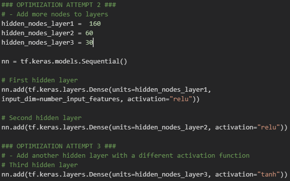

# Neural_Network_Charity_Analysis

## **Overview of the Analysis**

This analysis was conducted to determine an algorithm that better predicts whether an applicant to the AlphabetSoup philanthropic donation program will be have a successful outcome. Several input features, such as ***Asking Amount*** and ***Use Case***, where used as factors in the analysis.

### RESOURCES
- charity_data.csv
  
---
## **Results**

### DATA PREPROCESSING

Target variable
- IS_SUCCESSFUL
  
Feature variables
- APPLICATION_TYPE
- AFFILIATION 
- CLASSIFICATION 
- USE_CASE
- ORGANIZATION  
- STATUS
- INCOME_AMT 
- SPECIAL_CONSIDERATIONS
- ASK_AMT

Removed variables
- NAME
- EIN

### COMPILING, TRAINING, AND EVALUATING THE MODEL
Initially, the model consisted of 3 layers, two hidden and one output layer. The first hidden layer had 80 neurons, and the second 60. 

For the first optimization attempt, dropping the top 10 percent of the ASK_AMT feature was used to reduce the effect of outliers in the model.

For the second and third optimization attempt, adding more layers was tried, as well as changing the number of neurons per layer.

After optimization, the model ended up with 4 layers, 3 hidden and one output. The hiddens layers had 160, 60, 30 nodes, respectively. 

Unfortunately, the model did not achieve 75 percent accuracy.

---

## **Summary**

The end result was mostly successful in predicting outcomes, and could be used to guide further analysis. However, failing 25% of the time could lead to negative outcomes, and therefore is by no means foolproof.

Perhaps a Random Forest Classifier would work for this tabular data, as it is easier to implement and uses less resources.
